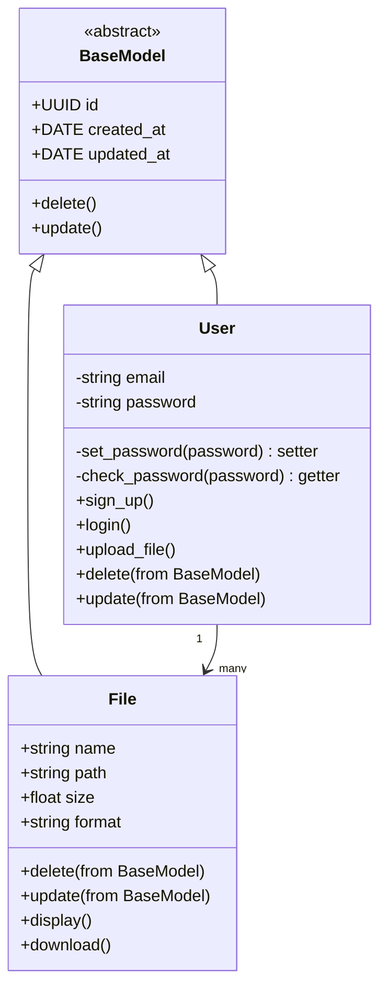

## Diagramme de classes — Modèle utilisateur et fichiers

Ce diagramme UML représente l’architecture orientée objet d’un système de gestion d’utilisateurs et de fichiers, en s’appuyant sur un modèle de base commun.

### Modèle abstrait : `BaseModel`

Modèle parent commun à toutes les entités persistées, il définit des attributs et méthodes de base :

- **Attributs :**
  - `id : UUID` — Identifiant unique
  - `created_at : DATE` — Date de création
  - `updated_at : DATE` — Date de dernière mise à jour

- **Méthodes :**
  - `delete()` — Supprime l’objet
  - `update()` — Met à jour l’objet

---

### Classe `User` (hérite de `BaseModel`)

Représente un utilisateur inscrit sur la plateforme.

- **Attributs privés :**
  - `email : string`
  - `password : string`

- **Méthodes :**
  - `set_password(password)` — Setter pour stocker le mot de passe de manière sécurisée
  - `check_password(password)` — Getter pour valider un mot de passe
  - `sign_up()` — Inscription de l’utilisateur
  - `login()` — Connexion de l’utilisateur
  - `upload_file()` — Téléversement d’un fichier
  - `delete()` et `update()` — Héritées de `BaseModel`

---

### Classe `File` (hérite de `BaseModel`)

Représente un fichier stocké par un utilisateur.

- **Attributs :**
  - `name : string` — Nom du fichier
  - `path : string` — Chemin d’accès
  - `size : float` — Taille en Mo/Ko
  - `format : string` — Type MIME ou extension

- **Méthodes :**
  - `display()` — Affiche les informations du fichier
  - `download()` — Télécharge le fichier
  - `delete()` et `update()` — Héritées de `BaseModel`

---

### Relations entre classes

- `User` hérite de `BaseModel`
- `File` hérite de `BaseModel`
- **Un utilisateur possède plusieurs fichiers** :  
  `User "1" --> "many" File`

