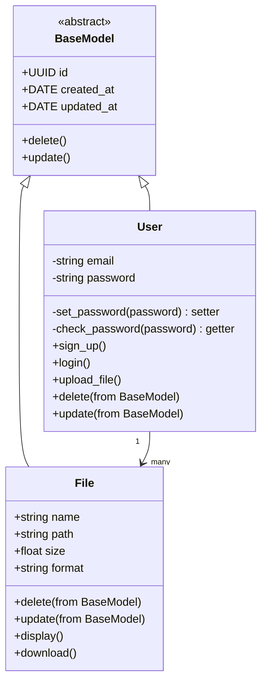

Notre Diagramme de classe pour notre conception :

```mermaid
classDiagram
  class BaseModel {
    <<abstract>>
    +UUID id
    +DATE created_at
    +DATE updated_at
    +delete()
    +update()
  }

  class User {
    -string email
    -string password
    -set_password(password)setter
    -check_password(password)getter
    +sign_up()
    +login()
    +upload_file()
    +delete(from BaseModel)
    +update(from BaseModel)
  }

  class File {
    +string name
    +string path
    +float size
    +string format
    +delete(from BaseModel)
    +update(from BaseModel)
    +display()
    +download()
  }

BaseModel <|-- User
BaseModel <|-- File

User "1" --> "many" File

```