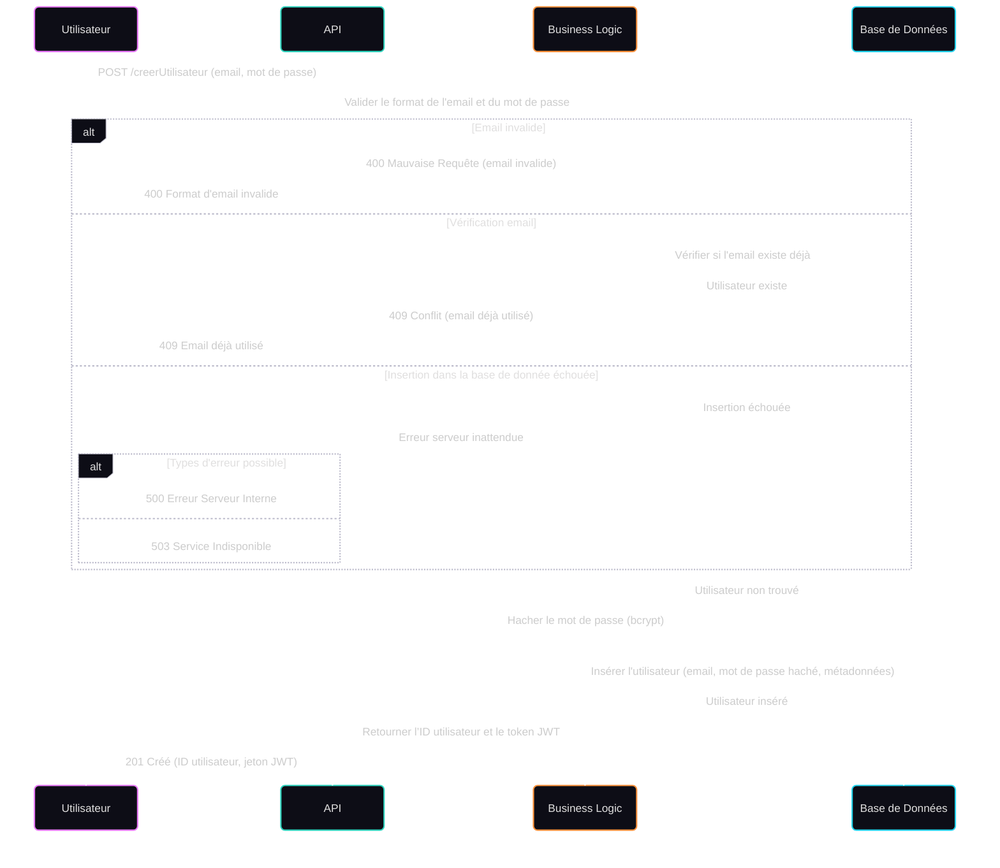

## Diagramme de séquence — Création d’un utilisateur

Ce diagramme représente les différentes étapes du processus de création d’un utilisateur via une API cloud. Il prend en compte les validations, les erreurs courantes, et le retour en cas de succès.

### Acteurs impliqués

- **Utilisateur** : déclenche la création avec un email et un mot de passe.
- **API** : point d'entrée HTTP de l'application.
- **Business Logic** : gère les règles métier (validation, hashage, etc.).
- **Base de Données** : stocke les informations utilisateurs.

### Étapes du processus

1. **Requête de création** via un `POST /creerUtilisateur`.
2. **Validation** du format de l'email et du mot de passe.
3. **Vérification de l’unicité** de l’email dans la base.
4. **Gestion des erreurs** :
   - `400 Bad Request` si l’email est invalide.
   - `409 Conflict` si l’email est déjà utilisé.
   - `500` ou `503` si un problème survient côté serveur.
5. **Hashage du mot de passe** avec `bcrypt`.
6. **Insertion en base de données**.
7. **Réponse de succès** avec `201 Created`, incluant un identifiant utilisateur et un token JWT.

### Codes HTTP gérés

| Code | Signification                     |
|------|----------------------------------|
| `201` | Utilisateur créé avec succès     |
| `400` | Format de données invalide       |
| `409` | Email déjà utilisé               |
| `500` | Erreur interne du serveur        |
| `503` | Service temporairement indisponible |
