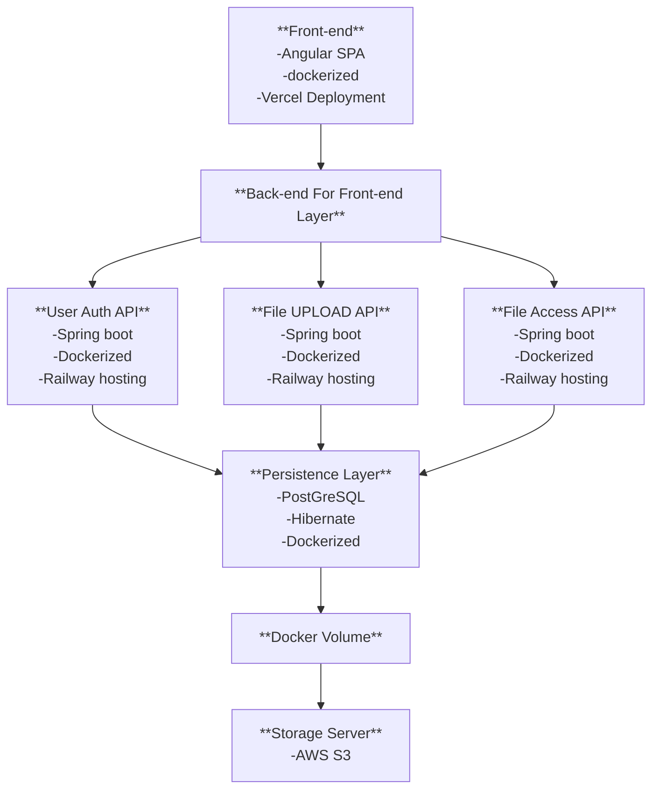

## Architecture de l'application

Cette architecture suit une approche **modulaire, containerisée et orientée services**, avec séparation claire entre le front-end, les APIs spécialisées, et les couches de persistance et de stockage.

---

### Front-end

- **Framework** : Angular (Single Page Application)
- **Déploiement** : via [Vercel](https://vercel.com)
- **Conteneurisation** : Docker
- **Rôle** : Fournit l'interface utilisateur et communique exclusivement avec la couche BFF.

---

### BFF (Back-end For Front-end)

- Sert d'intermédiaire entre le front-end et les microservices backend.
- Agit comme **agrégateur** et **orchestrateur d'appels API** pour simplifier la logique côté client.

---

### User Auth API

- **Framework** : Spring Boot
- **Fonction** : Authentification, inscription, génération de jetons JWT, validation
- **Conteneurisation** : Docker
- **Hébergement** : [Railway](https://railway.app)

---

### File Upload API

- **Framework** : Spring Boot
- **Fonction** : Gestion des uploads utilisateurs
- **Conteneurisation** : Docker
- **Hébergement** : Railway

---

### File Access API

- **Framework** : Spring Boot
- **Fonction** : Accès, lecture et métadonnées des fichiers
- **Conteneurisation** : Docker
- **Hébergement** : Railway

---

### Persistence Layer

- **Base de données** : PostgreSQL
- **ORM** : Hibernate
- **Conteneurisation** : Docker
- Gère la **persistence des entités utilisateurs, fichiers, métadonnées**, etc.

---

### Docker Volume

- Intermédiaire entre la base de données et le système de fichiers.
- Peut servir à stocker temporairement des fichiers avant synchronisation vers le stockage distant.

---

### Storage Server

- **Service utilisé** : AWS S3
- Stockage final des fichiers uploadés, accessible depuis la `File Access API`.

---

### Schéma de communication

- Le **Front-end Angular** communique avec le **BFF**.
- Le **BFF** appelle successivement les APIs :
  - `User Auth API` pour la gestion des comptes
  - `File Upload API` pour les dépôts
  - `File Access API` pour les récupérations
- Toutes les APIs partagent une **couche de persistence unique** (PostgreSQL).
- La persistence est connectée à un **Docker Volume**, lui-même synchronisé avec **AWS S3** pour le stockage.

---
